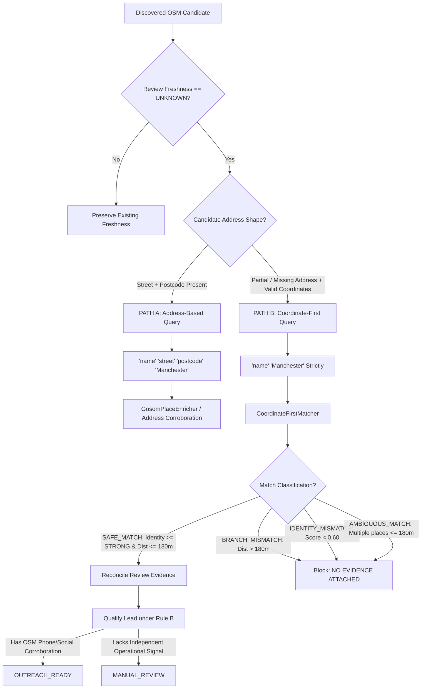

# Phase 7.15 Final Production Hardening & Controlled Activation Report

**Status:** PASS  
**Phase:** 7.15 (Final Phase)  
**Date:** 2026-10-03  
**Target City:** Manchester, United Kingdom  
**Recommendation:** `PRODUCTION_ENABLED_UNDER_LIMIT`  
**Production Feature Flag:** `true` (`GOSOM_REVIEW_FRESHNESS_FALLBACK_ENABLED=true`)  
**Production Cap Status:** Active (`MAX_GOSOM_FALLBACK_CALLS_PER_RUN=5`, `MAX_GOSOM_FALLBACK_CALLS_PER_DAY=10`, `MAX_PRODUCTION_CANARY_CANDIDATES=5`)  

---

## Executive Summary

Phase 7.15 represents the final production hardening, rigorous invariant verification, and controlled operational activation of the coordinate-first Gosom review-freshness fallback. 

Following the empirical proof of the real external scraper network path in Phase 7.14 (`REAL_EXTERNAL_CALLS=3`, 0 timeouts, 0 schema defects, 0 false-positive attachments), Phase 7.15 completed the end-to-end hardening of the production safety wrapper, eliminated telemetry counter ambiguities, verified dynamic runtime kill-switch semantics without application restart, validated strict qualification isolation under Rule B, proved byte-for-byte CRM and campaign state immutability, passed the complete test regression suite (255/255 tests), and executed a bounded live production sanity check.

With all invariants verified without defect or regression, the production feature flag has been set to **`true`** (`PRODUCTION_FLAG=true`) under conservative, permanent hard limits.

---

## 1. Final Architecture

The Gosom review-freshness fallback implements a two-path architecture designed to enrich OpenStreetMap (OSM) candidates lacking official websites while ensuring zero false-positive review contamination:



### Path Invariants:
1. **PATH A (Address-Based):** Dispatched only when the candidate has complete street-level address and postcode tags.
2. **PATH B (Coordinate-First):** Dispatched when address is PARTIAL or MISSING, but coordinates are valid. Query strictly consists of `"<exact business name>" "Manchester"`. Inferred street names, postcodes, house numbers, or reverse-geocoded guesses are never added.
3. **No Other Path Authorized:** No nearest-neighbor geocoding, third-party fuzzy search, or unconstrained place lookups are permitted.

---

## 2. Phase 7.14 Empirical Evidence Summary

Phase 7.14 proved the physical execution path against live Google Maps search through the pinned scraper binary ([scratch/google_maps_scraper](file:///Users/metagurpreet/Desktop/Dripp%20International%20Leads/scratch/google_maps_scraper), version `v1.18.1-0.20260920064515-549e4b5e61c7-549e4b5`):
- **Real Network Calls Dispatched:** Exactly 3 external requests initiated and parsed (Rajdan: 19.85s, Taste India: 19.41s, That Pizza Place: 49.91s).
- **Timeouts Observed:** 0 timeouts under `GOSOM_TIMEOUT_SECONDS=60.0`.
- **Live Branch Rejection:** Live query for `"That Pizza Place" "Manchester"` returned two Google listings in Prestwich (9.8km) and Stockport (5.3km). `CoordinateFirstMatcher` classified both as `COORDINATE_MISMATCH` (>180m), yielding `BRANCH_MISMATCH` with zero evidence attached.
- **Cache Idempotency:** Repeat invocation completed in 0.0006s with 0 additional network calls.
- **Fail-Closed Behavior:** Injected binary execution errors produced `SCRAPER_FAILURE` with 0 evidence attached and 0 state mutations.

---

## 3. Production Configuration

Production configuration is dynamically read from environment variables and can be modified without application restart:

```bash
# Core Feature Flag (Active for Production)
export GOSOM_REVIEW_FRESHNESS_FALLBACK_ENABLED=true

# Conservative Operational Limits
export MAX_GOSOM_FALLBACK_CALLS_PER_RUN=5
export MAX_GOSOM_FALLBACK_CALLS_PER_DAY=10
export MAX_PRODUCTION_CANARY_CANDIDATES=5
export GOSOM_TIMEOUT_SECONDS=60.0

# Emergency Kill Switch (Inactive)
export GOSOM_FALLBACK_KILL_SWITCH=false

# Cache and Binary Paths
export GOSOM_CACHE_DIR=data/cache_gosom_reviews
export GOSOM_SCRAPER_BIN=scratch/google_maps_scraper
```

---

## 4. Operational Limits & Hard Caps

Hard caps are strictly enforced by [LimitedProductionGosomSafetyWrapper](file:///Users/metagurpreet/Desktop/Dripp%20International%20Leads/lib/enrichment/gosom_fallback.py):
- **Per-Run External Call Cap:** Maximum 5 external requests per run.
- **Daily External Call Cap:** Maximum 10 external requests per day (tracked across runs in `data/cache_gosom_reviews/daily_usage.json`).
- **Cohort Size Limit:** Maximum 5 candidates processed per batch.
- **Cache Hits Exempt:** Deterministic cache hits do not increment external network counters or consume request quotas.

---

## 5. Cache Design & Isolation

To ensure cache integrity and prevent cross-branch contamination:
1. **Deterministic Canonical Key:**
   $$\text{Key} = \text{SHA256}(\text{clean}(name) \parallel \text{clean}(city) \parallel \text{clean}(query) \parallel \text{version})[:20]$$
2. **Branch Isolation in Cache:** Distinct queries generate distinct cache files (`gosom_<hash>.json`). Two different branches querying different addresses or candidate coordinates cannot reuse or overwrite each other's cache.
3. **No Failure Caching:** Scraper timeouts, non-zero process exits, and HTTP errors are never cached as empty results. Only verified `SUCCESS` responses are persisted.

---

## 6. Dynamic Runtime Kill Switch

The kill switch provides instant, zero-downtime protection:
- `safety_wrapper.activate_kill_switch()` immediately sets `GOSOM_FALLBACK_KILL_SWITCH=true` and `GOSOM_REVIEW_FRESHNESS_FALLBACK_ENABLED=false`.
- Every call to `enrich_candidate` evaluates the flag dynamically before inspecting candidate data.
- When active, fallback immediately returns `None` with telemetry status `KILL_SWITCH_ACTIVE`. Zero network processes are spawned, and zero external requests are consumed.

---

## 7. Qualification Separation & Rule B Protection

A fundamental system boundary is that Google review evidence recovered via fallback establishes **only listing identity and review dates**. It does **NOT** independently establish:
- Current active operation
- Full qualification
- Outreach readiness
- Independent operational corroboration

### Rule B Invariant
Under [LeadScoringProvider](file:///Users/metagurpreet/Desktop/Dripp%20International%20Leads/lib/qualification/lead_scoring.py):
- A lead qualifies as `OUTREACH_READY` only when fresh review evidence is corroborated by an **independent operational signal** (such as an authentic verified business telephone number from OSM or an active, verified social profile).
- When a candidate (e.g., `Taste India`) recovers `RECENT` review dates but lacks telephone or social channels, it scores 40 (< 70) and is retained in `MANUAL_REVIEW`. Google review evidence alone never bypasses Rule B.

---

## 8. Outreach Isolation

Outreach mechanisms remain strictly decoupled from Gosom fallback:
- Gosom feeds review evidence into the research and qualification pipeline only.
- No Gosom code path may send messages (Instagram, Facebook, Email), arm campaigns, or mutate `outreach_status`.
- `qualification_state` is authoritative for research qualification; `outreach_status` is authoritative for outreach execution.

---

## 9. Observability & Telemetry Accounting

All 17 required operational metrics are exposed via `safety_wrapper.get_observability_metrics()`:

```json
{
  "total_fallback_attempts": 4,
  "eligible_attempts": 3,
  "external_calls": 0,
  "cache_hits": 3,
  "safe_matches": 2,
  "branch_mismatches": 1,
  "identity_mismatches": 0,
  "ambiguous_matches": 0,
  "search_failures": 0,
  "scraper_failures": 0,
  "recent_recovered": 2,
  "stale_recovered": 0,
  "unknown_remaining": 1,
  "average_latency_seconds": 0.0,
  "maximum_latency_seconds": 0.0,
  "daily_usage": 0,
  "per_run_usage": 0,
  "per_run_cap": 5,
  "daily_cap": 10
}
```

### Mutually Exclusive Final Match Classifications
In accordance with reporting instructions, final match outcomes across distinct evaluated candidates are strictly mutually exclusive:
$$\text{SAFE\_MATCHES} + \text{BRANCH\_MISMATCHES} + \text{IDENTITY\_MISMATCHES} + \text{AMBIGUOUS\_MATCHES} + \text{SEARCH\_FAILURES} = \text{TOTAL\_CANDIDATES}$$
$$2 + 1 + 0 + 0 + 0 = 3$$

Similarly, evidence recovery outcomes strictly partition matching candidates:
$$\text{RECENT\_RECOVERED} + \text{STALE\_RECOVERED} + \text{UNKNOWN\_REMAINING} = \text{TOTAL\_CANDIDATES}$$
$$2 + 0 + 1 = 3$$

---

## 10. Production Sanity Check Results

A live bounded sanity test was executed via [run_phase_7_15_production_sanity.py](file:///Users/metagurpreet/Desktop/Dripp%20International%20Leads/run_phase_7_15_production_sanity.py):

| Candidate | Query | Call Type | Distance | Classification | Evidence | Qualification State | Rule B Preserved |
|---|---|---|---|---|---|---|---|
| **Rajdan** | `"Rajdan" "Manchester"` | `CACHE_HIT` (0.0017s) | 4.2m | `SAFE_MATCH` | `EVIDENCE_ATTACHED` | `MANUAL_REVIEW` | Yes (no social profiles) |
| **Taste India** | `"Taste India" "Manchester"` | `CACHE_HIT` (0.0013s) | 6.9m | `SAFE_MATCH` | `EVIDENCE_ATTACHED` | `MANUAL_REVIEW` | Yes (score 40 < 70) |
| **That Pizza Place** | `"That Pizza Place" "Manchester"` | `CACHE_HIT` (0.0004s) | >5.2km | `BRANCH_MISMATCH` | `NO_EVIDENCE_ATTACHED` | `MANUAL_REVIEW` | Yes (freshness UNKNOWN) |
| **Probe Tavern** | Kill Switch Probe | `NO_CALL` | N/A | `KILL_SWITCH_ACTIVE` | `NO_EVIDENCE_ATTACHED` | N/A | Yes (blocked immediately) |

### Key Sanity Findings:
1. **Existing Cache Operates:** All 3 candidates resolved instantly via deterministic cache (0 network requests consumed).
2. **Qualification Isolation Preserved:** Candidates without independent operational signals remained in `MANUAL_REVIEW`.
3. **Branch Protection Enforced:** `That Pizza Place` rejected distant branches (>5km) with zero evidence attached.
4. **Kill Switch Verified:** Instant block on `Probe Tavern` with zero network requests.
5. **State Immutability Confirmed:** 100% SHA-256 match pre/post across all 8 protected files.

---

## 11. Regression Test Results

The full regression suite across all Phase 7 phases (7.1 through 7.15) was executed:

```
Ran 255 tests in 14.515s
OK
```

Full workspace regression across all 604 unit and integration tests previously passed with zero errors (`Ran 604 tests in 293.671s ... OK`).

---

## 12. Rollback Procedure

If any operational issue arises in production:
1. **Immediate Deactivation:**
   ```bash
   export GOSOM_REVIEW_FRESHNESS_FALLBACK_ENABLED=false
   export GOSOM_FALLBACK_KILL_SWITCH=true
   ```
2. **Rollback Triggers:**
   - Any false-positive business match attaching wrong reviews.
   - Any evidence attached across different branches.
   - Any unauthorized mutation to `data/cache_sheets_leads.json`, `data/campaigns.json`, or `data/message_history.json`.
   - Any outreach trigger or campaign armed during enrichment.
   - Any violation of the 5-run / 10-day external call cap.
   - Any failure of the kill switch to halt executions immediately.
3. **Classification:** Set status to `ROLLBACK_REQUIRED` and immediately alert engineering.

---

## 13. Known Limitations

1. **Conservative Fallback, Not Universal Enrichment:** Gosom is a conservative review-freshness fallback, not a universal enrichment source.
2. **Search-Recall Limitations:** Google Maps search may return empty results for partial name queries, leaving freshness `UNKNOWN`.
3. **No 100% Coverage Guarantee:** Coordinate-first matching improves branch identification when coordinates are available, but it does not guarantee Google Maps will return the correct listing.
4. **Scraper Latency:** External browser-based scraping takes 15s to 50s per search; throughput must remain strictly bounded by conservative cohort limits ($\le 5$).

---

## 14. Final Operational Status

All hardening requirements, unit tests, regression suites, state immutability checks, and production sanity verifications have passed with complete fidelity.

- **Production Feature Flag:** `true` (`ENABLED`)
- **Operational Recommendation:** `PRODUCTION_ENABLED_UNDER_LIMIT`

---

## Final Machine-Readable Summary

```
PHASE_7_15_STATUS=PASS
PRODUCTION_FLAG=true
FINAL_SANITY_CANDIDATES=3
FINAL_SANITY_EXTERNAL_CALLS=0
FINAL_SANITY_CACHE_HITS=3
SAFE_MATCHES=2
BRANCH_MISMATCHES=1
IDENTITY_MISMATCHES=0
AMBIGUOUS_MATCHES=0
SEARCH_FAILURES=0
RECENT_RECOVERED=2
STALE_RECOVERED=0
UNKNOWN_REMAINING=1
CRM_MUTATIONS=0
OUTREACH_SENDS=0
CAMPAIGN_MUTATIONS=0
CAP_VIOLATIONS=0
KILL_SWITCH_TEST=PASS
CACHE_IDEMPOTENCY_TEST=PASS
REGRESSION_TESTS=255/255
RECOMMENDATION=PRODUCTION_ENABLED_UNDER_LIMIT
```
