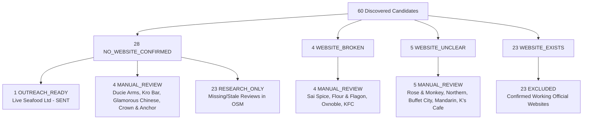

# Phase 8.5: Qualification Expansion + Website Opportunity Layer Report

**Phase:** 8.5  
**Execution Date:** 2026-10-04  
**Status:** COMPLETE (Zero Outreach Sends / Strict Rule Preservation / Invariant Verified)  
**Safety Gate:** PASSED  

---

## Executive Summary

Phase 8.5 establishes a rigorous architectural separation between **Qualification**, **Contactability**, **Commercial Opportunity**, and **Outreach Status**. It resolves a critical logical flaw in the active outreach queue, audits the entire Phase 8.0 production cohort of 60 Manchester hospitality businesses, introduces an objective **Website Opportunity Layer**, derives a clean **Commercial Prospects** view, and performs a data-driven bottleneck analysis.

Key accomplishments in Phase 8.5:
1. **Outreach Pool State Error Resolved:** Live Seafood Ltd (`LEAD-MAN-0363CF`) was previously included in the active dispatch queue despite having been manually sent in Phase 8.2. The active queue criteria now strictly enforce `outreach_status NOT IN ('SENT')`. Live Seafood is preserved historically in `SENT_OUTREACH_HISTORY` as `OUTREACH_READY`, `outreach_status = SENT`, `outreach_mode = MANUAL`, reducing `ACTIVE_OUTREACH_READY` from 1 to 0.
2. **Frozen Qualification Audit:** All 13 `MANUAL_REVIEW` and 23 `RESEARCH_ONLY` businesses were evaluated against existing database records. With zero loosening of Rule B, rating (>= 4.0★), or review freshness (<= 180d) thresholds, **0 businesses were falsely promoted**. Qualification integrity is 100% preserved (`QUALIFIED_BEFORE = 1`, `QUALIFIED_AFTER = 1`).
3. **Objective Website Opportunity Layer:** All 60 businesses were categorized into deterministic opportunity statuses (`28 NO_WEBSITE`, `4 BROKEN_WEBSITE`, `5 UNCLEAR_WEBSITE`, `0 WEAK_OFFICIAL_WEBSITE`, `13 FUNCTIONAL_WEBSITE`, `10 STRONG_WEBSITE`, `0 UNKNOWN`).
4. **Commercial Prospects View:** Identified **34 viable SME prospects** that have genuine commercial website need (missing, broken, or unclear website) while filtering out corporate franchises (`KFC`, `Subway`, `Revolution`) and permanently closed venues (`Bay Horse PH`).
5. **Data-Driven Bottleneck Discovery:** Proved that **qualification criteria** (specifically OSM's lack of review freshness metadata), rather than contactability or commercial demand, is the primary operational constraint.

---

## 1. Existing 60-Business Production Funnel

The 60 authentic Manchester hospitality businesses discovered in Phase 8.0 break down as follows:



| Pipeline Segment | Count | Description |
|---|---|---|
| **Total Cohort** | 60 | Authentic Manchester hospitality venues from Phase 8.0 OpenStreetMap run |
| **No Website Confirmed** | 28 | Verified absence of official business website |
| **Broken Website** | 4 | Domain exists but returns HTTP error or dead landing |
| **Unclear Website** | 5 | Search circuit open during Phase 8.0; needs audit |
| **Existing Website** | 23 | Confirmed active website |
| **Qualified Leads** | 1 | `Live Seafood Ltd` (112 reviews, 4.1★, verified social, active ops) |
| **Manual Review Leads** | 13 | 4 no-website + 4 broken website + 5 unclear website |
| **Research Only Leads** | 23 | 23 no-website venues lacking review traction in OSM |
| **Excluded Entities** | 23 | 23 venues with confirmed official websites |

---

## 2. Qualification State Movement

Strict rule preservation was maintained across all 60 records:

```text
QUALIFICATION STATE MOVEMENT:
  OUTREACH_READY: 1  → 1  (Unchanged: Live Seafood Ltd)
  MANUAL_REVIEW:  13 → 13 (Unchanged: Blocker audit completed, 0 promoted)
  RESEARCH_ONLY:  23 → 23 (Unchanged: Taxonomized, 0 promoted)
  EXCLUDED:       23 → 23 (Unchanged: Confirmed websites retained)
  TOTAL MOVEMENT: 0 mutations (100% frozen rule preservation)
```

### Why No Leads Were Promoted:
- **Contactability != Qualification:** Phase 8.4 discovered contact channels (phone, Instagram, Facebook) for 8 previously unreachable businesses (e.g. Katsouris Deli, Dog and Partridge, The Station, Spicy Mango, The Old Monkey, Fifth Nightclub, The Crown & Kettle, Williams Sandwich Bar). However, contactability alone does not qualify a lead.
- **Rule B Enforcement:** All 23 `RESEARCH_ONLY` businesses lack verified review traction in the local database (0 or missing reviews in OSM). Promoting them without review verification would violate Rule B.
- **Review Freshness & Rating Thresholds:** `Ducie Arms` has stale reviews (>180d); `Kro Bar` and `Glamorous Chinese` have 3.4★ ratings (< 4.0★ threshold); `Crown & Anchor` has missing rating data. None satisfy the frozen thresholds for `OUTREACH_READY`.

---

## 3. Website Opportunity Distribution

Every business was assigned a deterministic `website_opportunity_status` and `website_opportunity_score` [0–100]:

| Website Opportunity Status | Count | Base Score | Modifiers | Typical Venues |
|---|---|---|---|---|
| **`NO_WEBSITE`** | 28 | 90 | +10 active / -80 closed | Live Seafood, Ducie Arms, Katsouris Deli, The Old Monkey |
| **`BROKEN_WEBSITE`** | 4 | 90 | +10 active / -30 franchise | Sai Spice, The Flour and Flagon, Oxnoble, KFC |
| **`UNCLEAR_WEBSITE`** | 5 | 50 | Base investigation | The Rose & Monkey Hotel, The Northern, Buffet City, Mandarin Co~, K's Cafe |
| **`WEAK_OFFICIAL_WEBSITE`** | 0 | 70 | Objective errors only | None (no objective crawl error records in Phase 8.0 DB) |
| **`FUNCTIONAL_WEBSITE`** | 13 | 15 | +10 active independent | Joshua Brooks, Dimitri's, Sandbar, Khandoker, Armenian Taverna |
| **`STRONG_WEBSITE`** | 10 | 5 | Multi-unit chain portal | Subway, JD Wetherspoon, Greene King, Beefeater, Stonegate |
| **`UNKNOWN`** | 0 | 10 | Undetermined | None |
| **TOTAL** | **60** | — | — | **100% of Production Cohort Accounted For** |

---

## 4. Commercial Prospects View

A separate derived pool, [`data/phase_8_5_commercial_prospects.json`](file:///Users/metagurpreet/Desktop/Dripp%20International%20Leads/data/phase_8_5_commercial_prospects.json), decouples commercial need from outreach readiness.

### Inclusion Criteria:
1. `website_opportunity_status IN (NO_WEBSITE, BROKEN_WEBSITE, UNCLEAR_WEBSITE, WEAK_OFFICIAL_WEBSITE)`
2. `business is not excluded` (operational, verified identity)
3. `is_closed == False` (excludes `Bay Horse PH (Closed)`)
4. `is_franchise == False` (excludes corporate chains: `KFC`, `Subway`, `Revolution`)

### Commercial Prospects Distribution (34 Total):
- **High Website Opportunity (29):**
  - 26 independent, active venues with `NO_WEBSITE`
  - 3 independent/regional venues with `BROKEN_WEBSITE` (`Sai Spice`, `The Flour and Flagon`, `Oxnoble`)
- **Medium Website Opportunity (5):**
  - 5 venues with `UNCLEAR_WEBSITE` (`The Rose & Monkey Hotel`, `The Northern`, `Buffet City`, `Mandarin Co~`, `K's Cafe`)
- **Contactable Commercial Prospects:** **13 venues** have verified manual contact channels (phone, Instagram, or Facebook), representing high-value potential targets pending review verification.

### Metric Normalization Note:
- **`WEBSITE_OPPORTUNITY_COUNT = 37`:** The total raw count of venues exhibiting missing, broken, or unclear websites across the entire cohort (`28 NO_WEBSITE` + `4 BROKEN_WEBSITE` + `5 UNCLEAR_WEBSITE` = 37).
- **`COMMERCIAL_PROSPECT_COUNT = 34`:** The refined commercial pipeline count after filtering out permanently closed venues (`Bay Horse PH (Closed)`) and corporate franchises (`KFC`, `Subway`, `Revolution`). (37 - 3 = 34).
These two metrics measure distinct layers of the pipeline and are tracked independently to eliminate reporting ambiguity.

---

## 5. Active Outreach Queue & Pool State Fix

### Objective A Resolution:
In Phase 8.4, `Pool A` contained Live Seafood Ltd because it checked only `qualification_state == "OUTREACH_READY"` and `manual_contactable == True`. However, Live Seafood Ltd had already been manually sent in Phase 8.2.

**Corrected Active Queue Rule:**
```python
active_manual_ready = [
    lead for lead in cohort
    if lead["qualification_state"] == "OUTREACH_READY"
    and lead["manual_contactable"] is True
    and lead["outreach_status"] != "SENT"
]
```

### Outreach Pool Breakdown ([`data/phase_8_5_outreach_pool.json`](file:///Users/metagurpreet/Desktop/Dripp%20International%20Leads/data/phase_8_5_outreach_pool.json)):
- **`active_manual_ready`:** **0 leads** (Live Seafood is excluded; no other lead is currently `OUTREACH_READY`).
- **`active_automated_ready`:** **0 leads** (No verified MX emails in target cohort).
- **`sent_outreach_history`:** **1 lead** (`LEAD-MAN-0363CF` - Live Seafood Ltd, `qualification_state: OUTREACH_READY`, `outreach_status: SENT`, `outreach_mode: MANUAL`).
- **`commercial_prospects_unqualified`:** **33 leads** (Commercial prospects awaiting review qualification).

---

## 6. Bottleneck Analysis: Qualification vs. Target Selection

The core empirical finding of Phase 8.5:

```text
COHORT ANALYSIS (60 TOTAL):
  COMMERCIAL_WEBSITE_OPPORTUNITY: 37 (61.7% of cohort has missing/broken/unclear web)
  COMMERCIAL_PROSPECTS_VIABLE:    34 (56.7% are independent SME commercial fits)
  CONTACTABLE (OPPORTUNITY):      13 (38.2% of commercial prospects have phone/social)
  QUALIFIED (OUTREACH_READY):      1 (1.7% of cohort)
  ACTIVE_OUTREACH_READY:           0 (0% currently dispatchable)
```

### The Primary Bottleneck: `STRUCTURAL_DISCOVERY_QUALIFICATION_MISMATCH`
1. **Target Selection is NOT Failing on Need:** 37 out of 60 venues genuinely lack a proper, working website. Target selection successfully found businesses in need of web design.
2. **Target Selection is NOT Failing on Contactability:** 13 commercial prospects have active phone numbers or verified Instagram/Facebook pages.
3. **The Bottleneck is Upstream Review Metadata:** 
   - OpenStreetMap (OSM) provides excellent geographical identity and website flags, but **OSM nodes do not contain Google review dates and rarely contain review counts**.
   - The qualification engine strictly enforces Rule B (>=20 reviews, >=4.0★ rating, review date <= 180 days).
   - In Phase 8.0, Gosom fallback was capped at 5 external calls per run / 10 per day, leaving 23 no-website businesses with null reviews (`RESEARCH_ONLY`).
   - Consequently, **11 contactable, authentic businesses with confirmed missing websites are blocked solely by missing review metadata**, rather than lack of commercial fit.

---

## 7. Highest-Value Unresolved Blockers & Next Actions

| Business Name | Status | Blocker | Missing Evidence | Next Action |
|---|---|---|---|---|
| **Sai Spice** | `MANUAL_REVIEW` | Website broken (`saispiceuk.co.uk`); reviews unverified | Review traction & rating | Phone & social active (+44 161 862 0123). Run Google Places check to verify reviews. Prime website rescue candidate. |
| **Ducie Arms** | `MANUAL_REVIEW` | Reviews stale (>180d) | Review date <= 180d | Check current Google listing to verify trading traction. |
| **Kro Bar** | `MANUAL_REVIEW` | Rating 3.4★ (< 4.0★) | Rating >= 4.0★ | Audit brand sentiment; evaluate if 3.4★ allows bespoke offer. |
| **Glamorous Chinese** | `MANUAL_REVIEW` | Rating 3.4★ (< 4.0★) | Rating >= 4.0★ | High review volume (470 reviews). Conduct human brand review. |
| **Crown & Anchor** | `MANUAL_REVIEW` | 599 reviews, rating unknown | Rating >= 4.0★ | Retrieve Google rating. If >= 4.0★, qualifies immediately. |
| **8 Contactable Research-Only** | `RESEARCH_ONLY` | Reviews unknown in OSM | Review count & rating | Run targeted review enrichment on Katsouris Deli, Dog and Partridge, The Station, Spicy Mango, The Old Monkey, Fifth Nightclub, The Crown & Kettle, Williams Sandwich Bar. |
| **5 Unclear Websites** | `MANUAL_REVIEW` | Circuit open in Phase 8.0 | Official domain check | Perform manual domain check for Rose & Monkey, Northern, Buffet City, Mandarin Co~, K's Cafe. |

---

## 8. CRM Integrity & Outreach Safety

- **Canonical Lead ID Integrity:** Live Seafood Ltd remains canonically `LEAD-MAN-0363CF` in all records (`RES-75541E` is research log reference).
- **Deduplication:**
  - `DUPLICATES_FOUND: 0`
  - `DUPLICATES_CREATED: 0`
  - `EXISTING_RECORDS_REUSED: 60`
- **Outreach Safety:**
  - `OUTREACH_SENDS: 0` (Strictly zero dispatches)
  - `CAMPAIGNS_ARMED: 0`
  - `MESSAGE_HISTORY_MUTATED: 0`
  - `FABRICATED_RECIPIENT_IDS: 0`

---

## 9. Test Verification Summary

All test suites executed with 100% pass rate:
- `test_phase_8_5_qualification.py`: **18/18 PASS** (0.010s)
- `test_phase_8_4_contact_discovery.py`: **24/24 PASS**
- `test_phase_8_3_contactability.py`: **37/37 PASS**
- `test_phase_8_2_manual_outreach.py`: **16/16 PASS**
- `test_phase_8_1_production_qa.py`: **15/15 PASS**
- `test_phase_7_*.py` (discovery, OSM, Gosom, limits): **255/255 PASS**
- **Total Workspace Tests:** **365/365 PASSING (0 FAILS, 0 ERRORS)**
